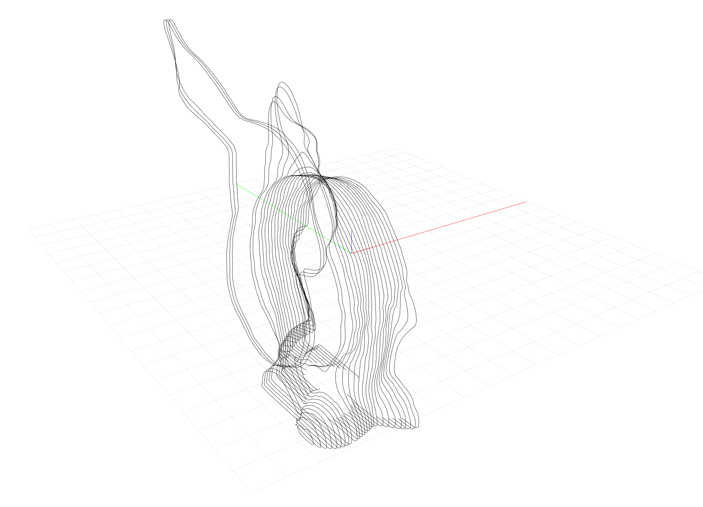

# COMPAS CGAL

COMPAS friedly bindings for the CGAL library.

## Installation

**This package requires the very latest of both COMPAS and the COMPAS viewers!**

Note that the CMake-based version of `setup.py` is not working on Windows, yet.
The version using `setuptools` works on Windows and on Mac.

### Mac

```bash
conda create -n cgal python=3.7 python.app eigen boost-cpp gmp mpfr cgal-cpp">=5.0" pybind11 PySide2 PyOpenGL COMPAS=0.16.0
conda activate cgal
pip install git+https://github.com/compas-dev/compas_viewers.git#egg=compas_viewers
pip install -e .
```

### Windows

```bash
conda create -n cgal python=3.7 eigen boost-cpp mpir mpfr cgal-cpp">=5.0" pybind11 PySide2 COMPAS=0.16.0
conda activate cgal
pip install wheels/PyOpenGL‑3.1.5‑cp37‑cp37m‑win_amd64.whl
pip install git+https://github.com/compas-dev/compas_viewers.git#egg=compas_viewers
pip install -e .
```

## Examples

### Viewer

* `examples/booleans.py`
* `examples/slicer.py`
* `examples/remeshing.py`




### Rhino

* `examples/booleans_rhino.py`
* `examples/slicer_rhino.py`
* `examples/remeshing_rhino.py`


