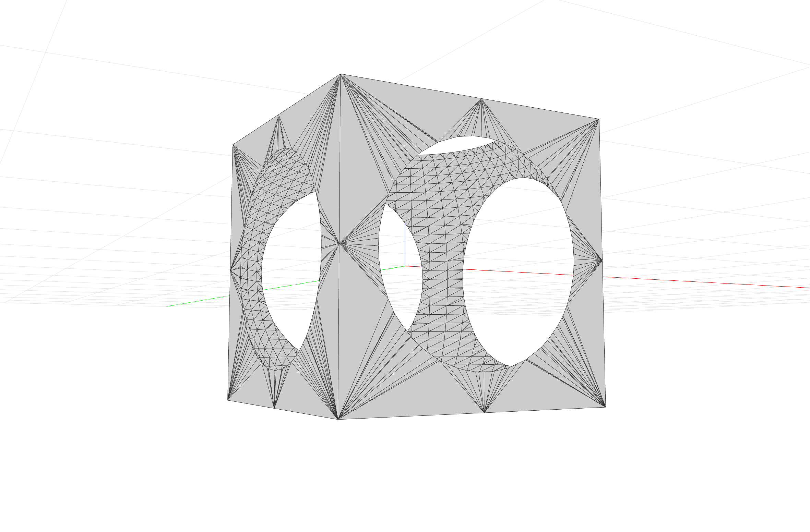
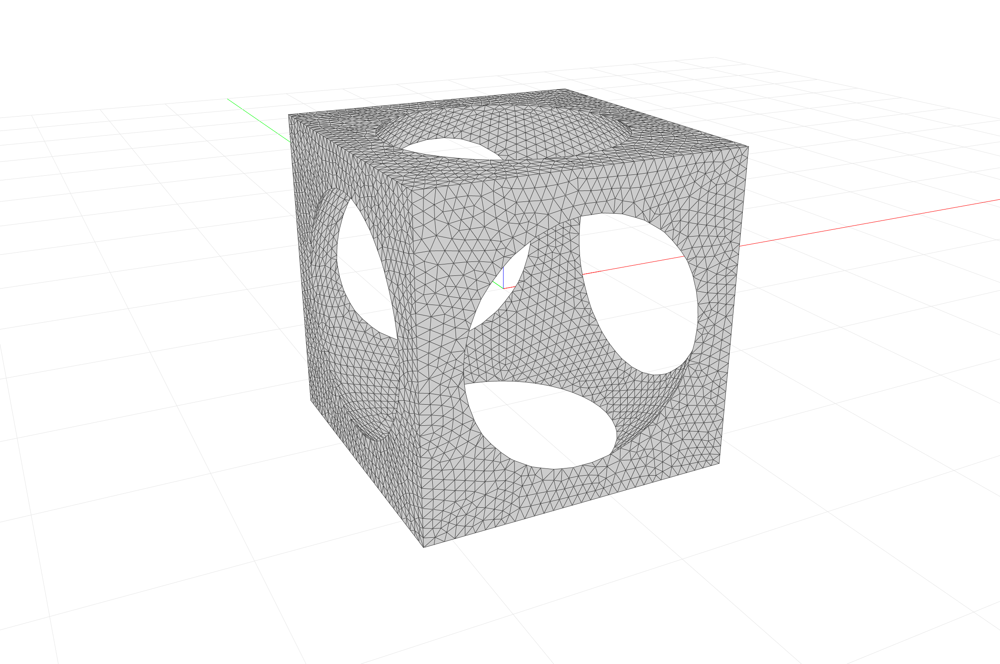
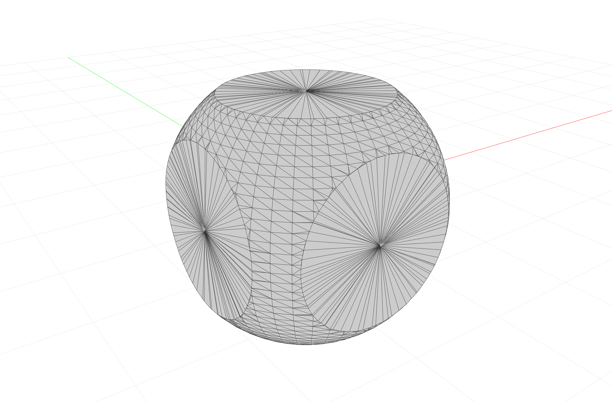

# COMPAS CGAL

COMPAS friedly bindings for the CGAL library.

## Installation

### Mac

```bash
conda create -n cgal python=3.7 python.app eigen boost-cpp gmp mpfr cgal-cpp">=5.0" pybind11
conda activate cgal
conda install COMPAS=0.16.0
conda install PySide2 PyOpenGL
pip install git+https://github.com/compas-dev/compas_viewers.git#egg=compas_viewers
pip install -e .
```

### Windows

```bash
conda create -n cgal python=3.7 eigen boost-cpp mpir mpfr cgal-cpp">=5.0" pybind11
conda activate cgal
conda install COMPAS=0.16.0
conda install PySide2
pip install wheels/PyOpenGL‑3.1.5‑cp37‑cp37m‑win_amd64.whl
pip install git+https://github.com/compas-dev/compas_viewers.git#egg=compas_viewers
pip install -e .
```

## Repo Structure

The `ext_modules` part of `setup.py` shows where the important bits are.

```python
ext_modules = [
    Extension(
        'compas_cgal._cgal',
        sorted([
            'src/compas_cgal.cpp',
            'src/trimesh.cpp',
            'src/meshing.cpp',
            'src/booleans.cpp',
            'src/slicer.cpp',
        ]),
        include_dirs=[
            './include',
            get_eigen_include(),
            get_pybind_include()
        ],
        library_dirs=[
            get_library_dirs(),
        ],
        libraries=['mpfr', 'gmp'],
        language='c++'
    ),
]
```

## Examples

### 1. Booleans

**Mesh-Mesh Union.**


**Mesh-Mesh Difference.**




**Mesh-Mesh Intersection.**



### 2. Slicing

**Slice mesh by plane.**


### 3. Remeshing

**Mesh remeshing.**


