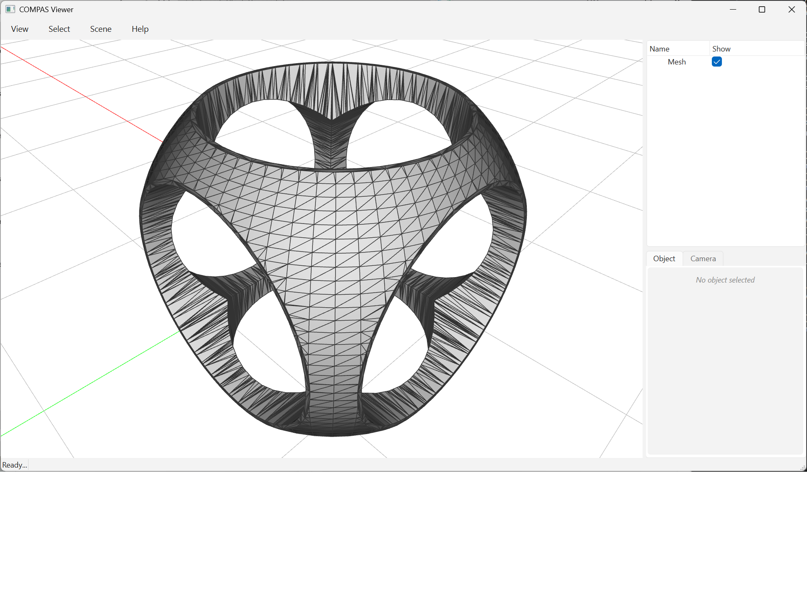

# CSG: Rounded Cube Drilled Along Three Axes



A classic constructive solid geometry workflow expressed as a single
`boolean_chain` call:

1. **Rounded cube** = cube ∩ sphere — the sphere clips the cube's corners.
2. **Drilled rounded cube** = result − cyl_x − cyl_y − cyl_z, where each
   cylinder is centered at the origin and oriented along one world axis.

All five input meshes are sent to C++ in a single `boolean_chain` call.
Intermediate Surface_meshes never leave C++; only the final `(V, F)` is
returned to Python.

The cylinders meet at the origin — a degenerate configuration that would
trip CGAL's "Non-handled triple intersection" precondition during a naive
sequential subtraction with the inexact-constructions kernel. Between
corefinement steps `boolean_chain` applies CGAL 6.1's
`autorefine_triangle_soup` with `apply_iterative_snap_rounding(true)`,
[introduced specifically for this problem](https://www.cgal.org/2025/06/13/autorefine-and-snap/),
which makes the chain robust at radii up to ~0.7 in this geometry.

```python
---8<--- "docs/examples/example_boolean_difference_mesh_meshes.py"
```
