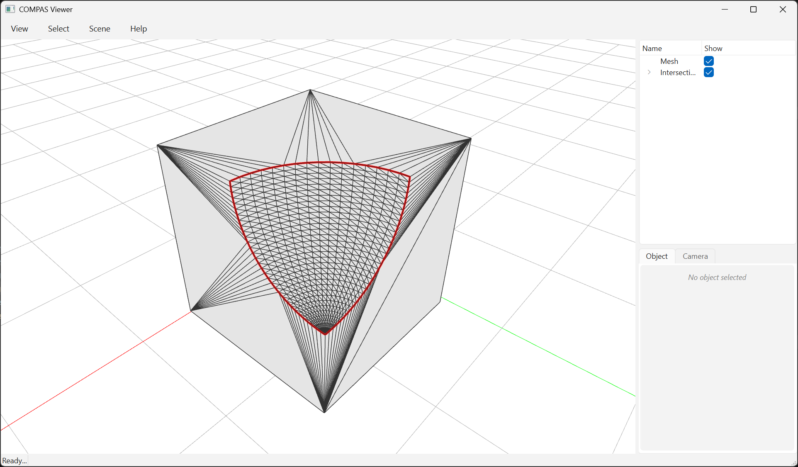

# Boolean Operations with Intersection Edges



The `*_with_edges` variants of the boolean operations return the result mesh
together with the corefinement intersection curve as vertex-index pairs into
the output mesh. This avoids re-deriving the cut boundary from the dense
triangulated output, and is useful for recovering clean polygonal outlines or
grouping triangles that share a common original face.

The function returns a tuple `(V, F, E)`:

* `V` — `Nx3` vertex coordinates
* `F` — `Mx3` triangle face indices
* `E` — `Kx2` vertex-index pairs marking edges that lie on the intersection curve

```python
---8<--- "docs/examples/example_booleans_with_edges.py"
```
