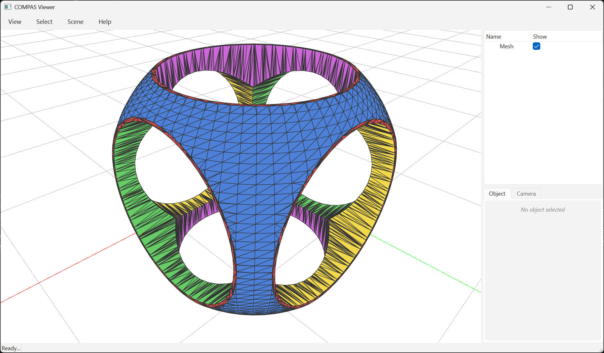

# Boolean Chain with Face Source Tracking



This is the same CSG as
[Boolean Difference With Many Cutters](example_boolean_difference_mesh_meshes.md)
— `cube ∩ sphere − cyl_x − cyl_y − cyl_z` — but with every output face
colored by which of the five input meshes it descended from.

Color legend:

| `mesh_id` | input mesh | color  |
|----------:|------------|--------|
| 0         | cube       | red    |
| 1         | sphere     | blue   |
| 2         | cyl_x      | green  |
| 3         | cyl_y      | yellow |
| 4         | cyl_z      | magenta|

`boolean_chain_with_face_source` returns `(V, F, S)`:

* `V` — `Nx3` vertex coordinates
* `F` — `Mx3` triangle face indices
* `S` — `Mx2` int array; `S[i] = [mesh_id, face_id]` for output face `i`,
  pointing back to the original input face it descended from.

Tracking is done via a CGAL corefinement visitor that propagates per-face
tags through subface creations and face copies.

## Why slight cylinder offsets?

The companion example
[Boolean Difference With Many Cutters](example_boolean_difference_mesh_meshes.md)
uses
[CGAL 6.1's autorefine_triangle_soup snap rounding](https://www.cgal.org/2025/06/13/autorefine-and-snap/)
between corefinement steps to repair rounding-induced degeneracies — that's
how it handles three cylinders converging at the origin without crashing.

The `*_with_face_source` chain cannot use that pipeline: the visitor's
per-face property maps don't survive the soup conversion. So instead, this
example shifts each cylinder by a fraction of a millimetre perpendicular to
its axis, breaking the exact three-way intersection at the origin while
remaining visually indistinguishable from the snap-rounded version.

If you don't need source tracking and want exactly-axial cylinders, use
[`boolean_chain`](example_boolean_difference_mesh_meshes.md) instead.

```python
---8<--- "docs/examples/example_booleans_with_face_source.py"
```
