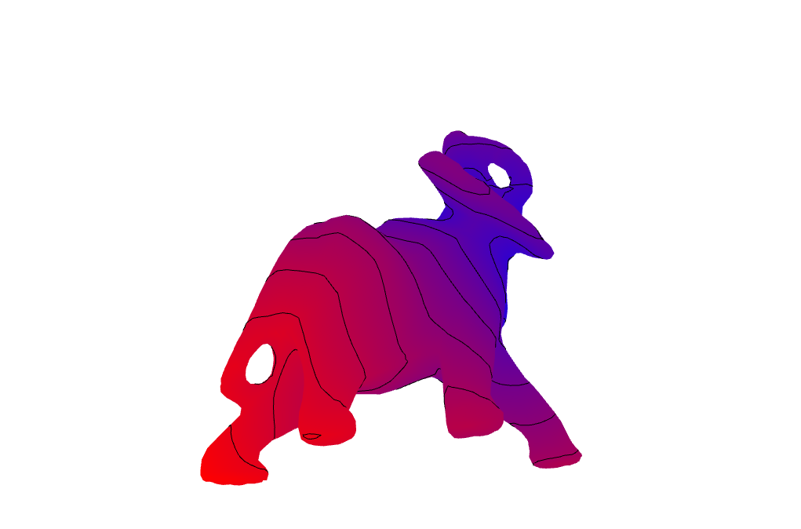

# Exact Geodesic Distance from a Surface Point



The exact backend computes the polyhedral geodesic distance from a source located
anywhere on the mesh surface. This compact example places one source at the
centroid of a face, colors the mesh by distance, and draws distance isolines.

The source is passed to
`exact_geodesic_distances_from_points`, demonstrating the point-source API
without snapping the source to a mesh vertex. The red isolines are extracted
from the resulting vertex scalar field with [isolines](example_isolines.md).

## What "exact" means here

Exact refers to the algorithm, not to the arithmetic. The shortest path across the polyhedron is
computed without algorithmic approximation — no time step, no diffusion, and no
dependence on triangle quality — but it is evaluated in double precision under CGAL's
`Exact_predicates_inexact_constructions_kernel`. Geodesic distance is a construction, built from
unfoldings and square roots, so the returned numbers carry ordinary floating-point
error.

```python
---8<--- "docs/examples/example_geodesics_exact.py"
```
