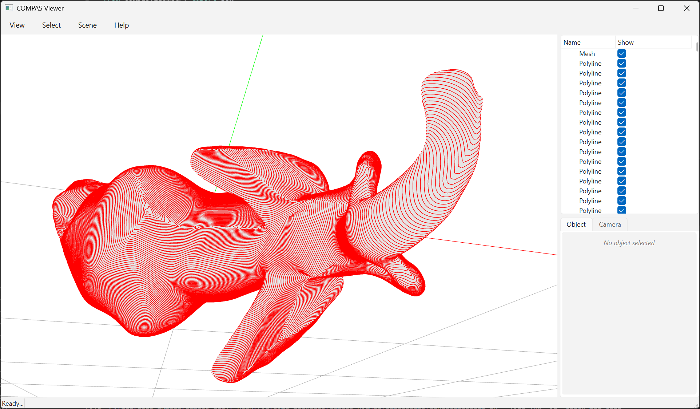

# Isolines from Scalar Fields



This example demonstrates isoline extraction from arbitrary vertex scalar fields using COMPAS CGAL.

The visualization shows an elephant mesh with isolines extracted from geodesic distances computed from five source points: the four feet and the snout.

Key Features:

* Generic isoline extraction from any vertex scalar field via ``isolines``
* Support for explicit isovalues or automatic even spacing
* Adaptive resampling for smoother output
* Optional Laplacian smoothing

```python
---8<--- "docs/examples/example_isolines.py"
```
