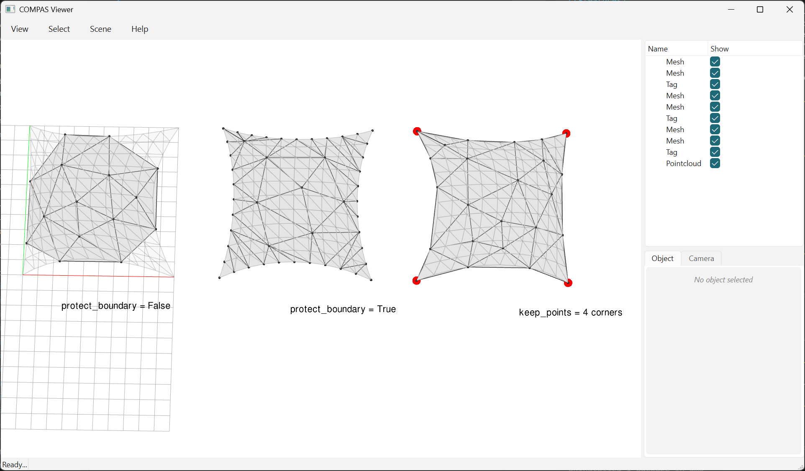

# Mesh Remeshing



This example demonstrates how to remesh a triangle mesh with COMPAS CGAL, and the three ways `trimesh_remesh` can treat the boundary of an open mesh.

A RhinoVault funicular shell is triangulated and remeshed to the same coarse target edge length three ways, shown side by side (each drawn over the faint original for reference):

* **Left — `protect_boundary=False`** (default): boundary edges are re-sampled to the target length, so the shell's open perimeter is coarsened and its corners rounded.
* **Middle — `protect_boundary=True`**: every boundary edge is constrained, so the whole perimeter is preserved verbatim while the interior is coarsened.
* **Right — `keep_points=<4 corners>`**: only the four corner vertices are pinned (matched by coordinate). The rest of the boundary is still re-sampled, but those four points (shown in red) survive exactly.

`protect_boundary` and `keep_points` are complementary: the first keeps the entire boundary curve, the second keeps only the specific vertices you name. The companion parameter `protect_sharp_edges_angle_deg` similarly constrains interior feature edges whose dihedral angle exceeds a threshold.

Key Features:

* Loading PLY mesh files
* Remeshing with a target edge length via `trimesh_remesh`
* Preserving the whole boundary with `protect_boundary`
* Pinning only specific vertices with `keep_points`
* Side-by-side visualization of the three results over the original

```python
---8<--- "docs/examples/example_meshing.py"
```
