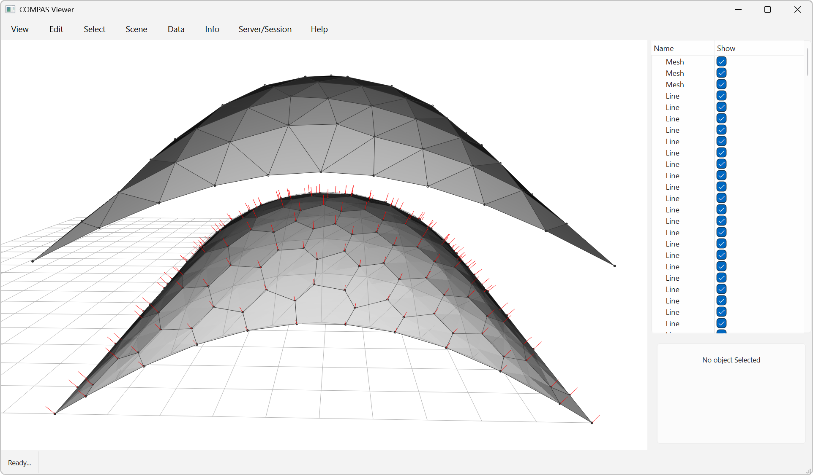

# Mesh Dual Remeshing



This example demonstrates how to remesh a triangle mesh using COMPAS CGAL.

Key Features:

* Constrained Remeshing with Fixed Vertices
* Dual Remeshing with Target Edge Length
* Dual vertices are fixed by angle or/and vertex index.

```python
---8<--- "docs/examples/example_meshing_dual.py"
```
