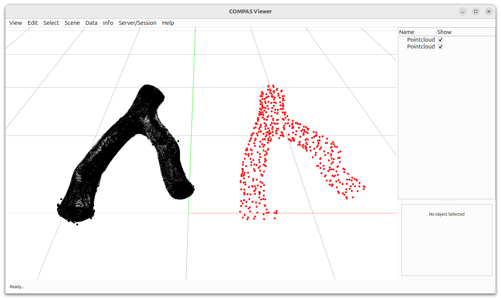

# Point Cloud Reduction



This example demonstrates how to reduce the density of a point cloud using COMPAS CGAL.

Key Features:

* Loading point clouds from PLY files
* Point cloud density reduction with specified percentage
* Side-by-side visualization of original and reduced point clouds

```python
---8<--- "docs/examples/example_reconstruction_pointset_reduction.py"
```
