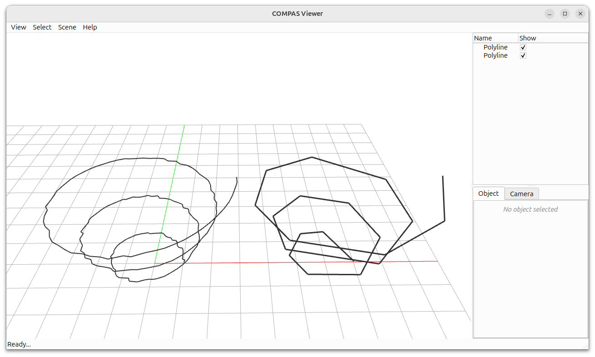

# Polyline Simplification



This example demonstrates how to simplify polylines using the Douglas-Peucker algorithm in COMPAS CGAL.

Key Features:

* Douglas-Peucker polyline simplification
* XY-plane simplification with Z-coordinate preservation
* Side-by-side visualization of original and simplified polylines

```python
---8<--- "docs/examples/example_simplify_polylines.py"
```
