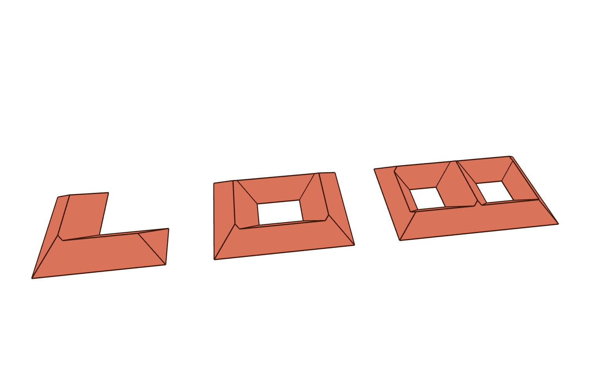

# Straight Skeleton Extrusion (Roofs)



This example demonstrates how to extrude a 2D polygon into a closed 3D roof mesh using
the straight skeleton, powered by CGAL's [`extrude_skeleton`](https://doc.cgal.org/latest/Straight_skeleton_2/group__PkgStraightSkeleton2Extrusion.html)
(see also this [overview of the improved straight skeleton](https://www.cgal.org/2023/05/09/improved_straight_skeleton/)).
This is particularly useful for quickly generating roof geometry from building footprints.

The example builds a small "street" of three roofs, covering a few corner cases:

* a simple footprint without holes (an L-shaped hip roof),
* a footprint with a single hole (a courtyard),
* a footprint with multiple holes (two courtyards).

Key Features:

* Turning a building footprint (polygon, optionally with holes) into roof geometry
* Controlling the roof pitch with a taper `angle` (in degrees) or straight skeleton `weights`
* Optionally capping the roof with a `maximum_height` to create a truncated roof

`extrude` returns everything needed to visualize the roof: a triangulated, ready-to-display
mesh (so even non-convex roof faces render correctly) and the roof outline as a list of lines
(the eaves, hips and ridges). The example simply adds the mesh with hidden edges and draws the
outline on top:

```python
mesh, lines = extrude(footprint, holes=holes, angles=45.0)
viewer.scene.add(mesh, show_lines=False)
for line in lines:
    viewer.scene.add(line)
```

The propagation speed of each contour edge determines the slope of the corresponding roof
face. A uniform taper angle of `45` degrees (equivalent to a weight of `1`) produces a
standard hip roof. Smaller angles give flatter roofs, larger angles steeper ones. Providing
a `maximum_height` (required for vertical or outward slopes) truncates the roof at that height.

```python
---8<--- "docs/examples/example_straight_skeleton_2_extrude.py"
```
