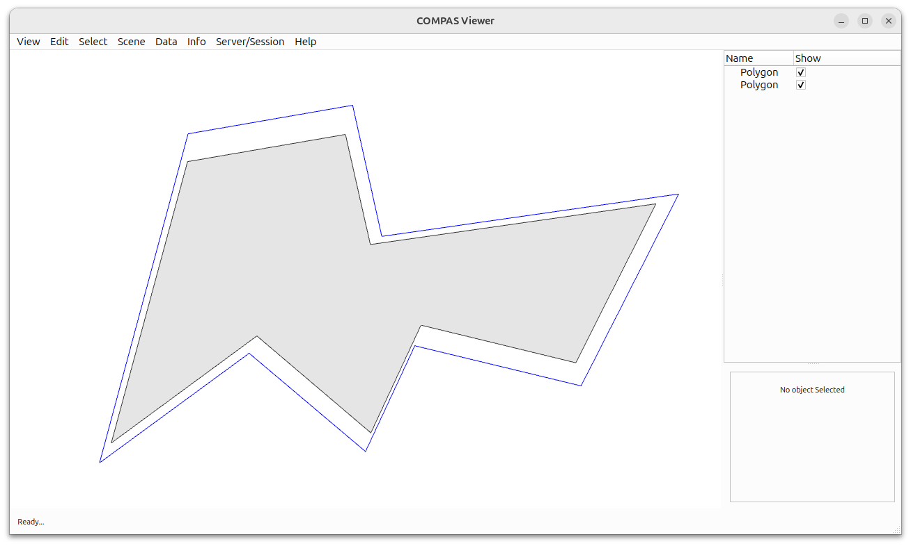

# Weighted Polygon Offsetting

This example demonstrates how to create weighted offset polygons using COMPAS CGAL.

Key Features:

* Creating weighted polygon offsets
* Specifying different weights for each edge
* Visualization of original and weighted offset polygons



```python
---8<--- "docs/examples/example_straight_skeleton_2_interior_straight_skeleton_weighted_offset_polygon.py"
```
