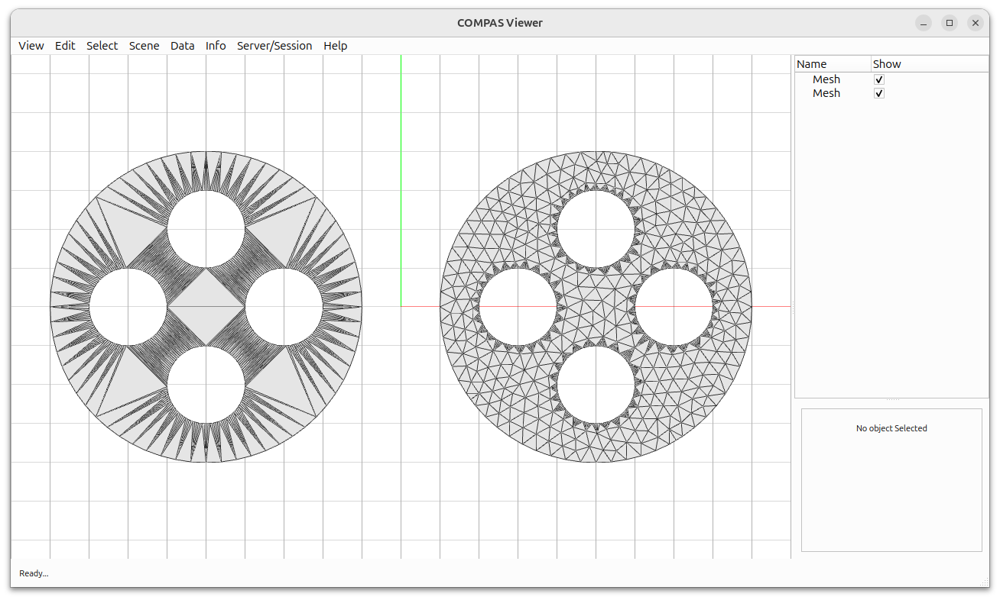

# Mesh Triangulation

This example demonstrates how to perform constrained and refined Delaunay triangulation using COMPAS CGAL.

Key Features:

* Creating polygonal boundary and holes
* Conforming Delaunay triangulation
* Refined Delaunay meshing with size constraints
* Side-by-side visualization of different triangulation methods



```python
---8<--- "docs/examples/example_triangulation.py"
```
